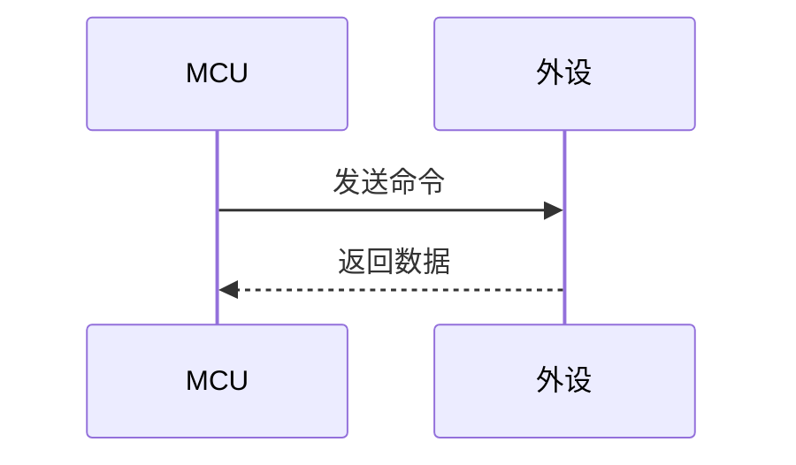
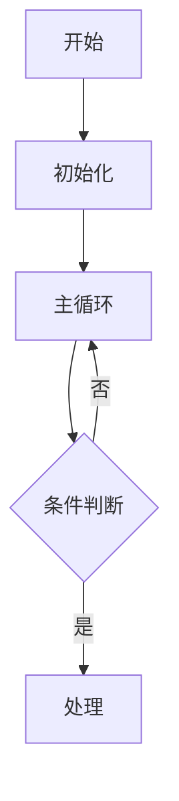

---
tags:
  - 嵌入式
date: 2026-07-16
time: 14:44
---
ctrl+alt+空格（代码函数的提示）
# 📌 32DAY1

## 🎯 目标 / 目的

> 用一句话说清楚：这个笔记要解决什么问题、达成什么目的？
1.完成工程的建立，掌握HAL库建立工程和标准库
2.时钟和高和低寄存器，RCC引脚图片
3.（完成对代码的分析）
4.  .h/.c文件，以及库函数
5. GPIO和寄存器  FT是容忍5V的
6. 高低电平的输入方式
7. 三极管开关（分析电路图）
### 🔑 关键结论 / 总结
 
# 📌 32DAY2
## 🎯 目标 / 目的
 用一句话说清楚：这个笔记要解决什么问题、达成什么目的？
1.RCC
2.逻辑 | 逻辑&，江协科技的指针
3.完成流水灯的设计（控制代码是低16位32位是什么）
4.
5.上拉电阻和下拉电阻
6.
7.宏定义与typedef，以及枚举（取值受限）
# 📌 32DAY3

1.GPIO定义：16：45【3-4】
```
void GPIO_DeInit(GPIO_TypeDef* GPIOx);
void GPIO_AFIODeInit(void);
void GPIO_Init(GPIO_TypeDef* GPIOx, GPIO_InitTypeDef* GPIO_InitStruct);
void GPIO_StructInit(GPIO_InitTypeDef* GPIO_InitStruct);
uint8_t GPIO_ReadInputDataBit(GPIO_TypeDef* GPIOx, uint16_t GPIO_Pin);
uint16_t GPIO_ReadInputData(GPIO_TypeDef* GPIOx);//读取输入寄存器GPIO原理图上面的部分
uint8_t GPIO_ReadOutputDataBit(GPIO_TypeDef* GPIOx, uint16_t GPIO_Pin);
uint16_t GPIO_ReadOutputData(GPIO_TypeDef* GPIOx);
void GPIO_SetBits(GPIO_TypeDef* GPIOx, uint16_t GPIO_Pin);
void GPIO_ResetBits(GPIO_TypeDef* GPIOx, uint16_t GPIO_Pin);
void GPIO_WriteBit(GPIO_TypeDef* GPIOx, uint16_t GPIO_Pin, BitAction BitVal);
void GPIO_Write(GPIO_TypeDef* GPIOx, uint16_t PortVal);
void GPIO_PinLockConfig(GPIO_TypeDef* GPIOx, uint16_t GPIO_Pin);
void GPIO_EventOutputConfig(uint8_t GPIO_PortSource, uint8_t GPIO_PinSource);
void GPIO_EventOutputCmd(FunctionalState NewState);
void GPIO_PinRemapConfig(uint32_t GPIO_Remap, FunctionalState NewState);
void GPIO_EXTILineConfig(uint8_t GPIO_PortSource, uint8_t GPIO_PinSource);
void GPIO_ETH_MediaInterfaceConfig(uint32_t GPIO_ETH_MediaInterface);
```
2.读取GPIO口的话要Input函数，要片上外设输出的话要OUTput函数
3.不理解复位函数，上拉电阻的组值
4.调试方式（串口，显示屏，keil哇）
### 🔑 关键结论 / 总结
设计按键控制LED的装置
原理：按键按压（连接到）LED亮，案件关闭不亮，再次摁下LED不亮
---

## 📋 背景 / 上下文

- 芯片 / 开发板型号：STM32F103C8T6
- 开发环境 / 工具链：Keli5
- 相关协议 / 标准：
- 前置知识 / 依赖：
- 涉及的外设 / 模块：

---

## 📝 核心内容

### 原理概述
RCC寄存器使能GPIO,GPIO是APB2的外设时钟


### 硬件连接 / 原理图

> 引脚连接、电路示意等。

| 引脚 (MCU) | 引脚 (外设) | 说明 |
|:----------:|:----------:|:----|
|            |            |      |

```plaintext
┌──────────┐         ┌──────────┐
│   MCU    │────────│  外设    │
│  PIN_x   │        │  PIN_y   │
└──────────┘         └──────────┘
```


---

### 寄存器 / 配置说明

| 寄存器 | 地址 | 位段 | 说明 |
|:------|:----:|:----|:----|
|       |      |      |      |

---

### 关键参数 / 计算


---

### 代码实现

```c

```

```cpp

```

```python

```

---

### 调试记录 / 踩坑笔记

| 现象 | 原因 | 解决方法 |
|:----|:----|:--------|
|     |     |         |

---

### 时序图 / 流程图





---

### 波形 / 逻辑分析


---

### 实验数据 / 测试结果

| 测试条件 | 预期结果 | 实际结果 | 是否通过 |
|:--------|:--------|:--------|:--------:|
|         |         |         |          |

---

## 🔑 关键结论 / 总结


---

## ✅ 行动项 / TODO

- [ ] 
- [ ] 
- [ ] 

---

## 📎 参考 / 链接

- 数据手册： [[[STM32F10xxx参考手册（中文）.pdf](file:///E:/STM32%E5%85%A5%E9%97%A8%E6%95%99%E7%A8%8B%E8%B5%84%E6%96%99/%E5%8F%82%E8%80%83%E6%96%87%E6%A1%A3/STM32F10xxx%E5%8F%82%E8%80%83%E6%89%8B%E5%86%8C%EF%BC%88%E4%B8%AD%E6%96%87%EF%BC%89.pdf)]]
- 参考笔记： [[]]
- 外部资料：
- 源码仓库：

---

## 💡 延伸思考 / 备注

> 后续可以深入研究的方向、相关知识点、灵感碎片……

	