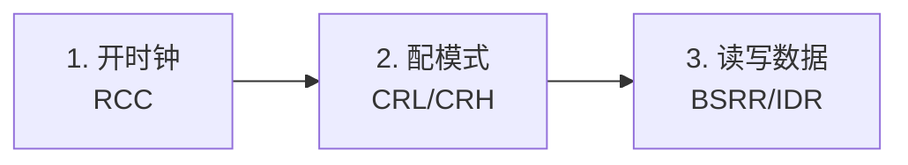

gpio和apb2之间的关系
GPIO


### 引脚到外设
 	输入：
		上拉输入（上通下开）默认高电平的输入方式
		下拉输入（上面的相反）默认低电平的输入方式
		浮空输入（都断）
		模拟输入（ADC）:把连续的模拟信号（电压、声音、温度、光线）转换成芯片能识别的二进制数字信号，是模拟世界与数字芯片的桥梁
上拉和下拉都是提供一个默认电平的
==判断输入方式的选择都是通过I/O的驱动能力==
### 程序到I/O口
位==设置/清除寄存器==完成的是对单独一位位置的操作（不是16位整体 的==输出数据寄存器==）
> [寄存器](寄存器.md)

	输出（都是输出控制器控制，两个mos管）：
			推挽输出：当数据是1时上开下断（高电平VDD）反之为0的时候（低电平）
			开漏输出（一般是通信协议：I^2C通信）：（只有N-mos管开通，P-mos管不使用）当为0时下管打开是低电平，当时1时间什么mos管都不打开（可以外接电阻）
			关闭输出：mos管都无效，由端口的电平控制（外部信号）
			复用推挽输出：由片上外设控制
			复用开漏输出：

---349到360比较重要
tags:
  - 嵌入式
  - STM32
  - GPIO
  - AFIO
  - 知识库
created: 2026-07-16
---

# GPIO 和 AFIO 补充笔记

> [!info] 说明
> 上面是我之前的学习记录，下面是补充整理的系统知识，两部分合在一起形成完整的 GPIO + AFIO 知识库。

相关笔记：[[寄存器]] [[32学习笔记]]

---

## GPIO 是什么

GPIO（General Purpose Input/Output）= 通用输入输出端口。就是芯片上那些可以自由控制的引脚。

每个 GPIO 引脚都能做两件事：
- **读**：感知外部电平是高还是低（比如按键有没有按下）
- **写**：输出高电平或低电平（比如点亮 LED）

STM32F103C8T6 有 GPIOA ~ GPIOC 三组端口，每组 16 个引脚（Pin0~Pin15）。

> [!note] GPIO 和时钟的关系
> GPIO 挂在 APB2 总线上。用之前必须先在 RCC 里打开对应端口的时钟，否则配置不生效。

---

## 引脚内部长什么样

一个 GPIO 引脚的内部结构可以简化成这样：

```
                    VDD（3.3V）
                     │
                 ┌───┴───┐
                 │ P-MOS │  ← 上管
                 └───┬───┘
    ┌────────────────┼────────────────┐
    │           引脚 Px_x             │ ←── 外部引脚
    │                │                │
    │           ┌───┴───┐             │
    │           │ N-MOS │  ← 下管     │
    │           └───┬───┘             │
    │                │                │
    │              VSS（0V）           │
    │                                 │
    │  ┌─────┐  ┌─────┐  ┌─────┐     │
    │  │上拉 │  │下拉 │  │施密特│     │
    │  │电阻 │  │电阻 │  │触发器│     │
    │  └──┬──┘  └──┬──┘  └──┬──┘     │
    │     │        │        │         │
    │     └────────┴────────┘         │
    │              │                   │
    │         保护二极管                │
    └──────────────────────────────────┘
```

几个关键部件的作用：

| 部件 | 作用 | 大白话解释 |
|:-----|:-----|:-----------|
| P-MOS（上管） | 接通时引脚拉到 VDD（高电平） | 像"向上拉的开关" |
| N-MOS（下管） | 接通时引脚拉到 VSS（低电平） | 像"向下拉的开关" |
| 上拉电阻 | 默认把引脚拉到高电平 | "没人按按钮时默认是 1" |
| 下拉电阻 | 默认把引脚拉到低电平 | "没人按按钮时默认是 0" |
| 施密特触发器 | 把模拟电平整形成干净的数字 0/1 | "模糊信号变清晰" |
| 保护二极管 | 防止电压过高或过低烧坏芯片 | "防雷器" |

---

## 8 种工作模式

STM32 的每个引脚可以配成 8 种模式：4 种输入 + 4 种输出。

### 四种输入模式

| 模式 | 上拉/下拉 | 特点 | 用在哪 |
|:-----|:---------|:-----|:-------|
| 浮空输入 | 都断开 | 引脚悬空，电平不确定 | 通信接收（USART RX）、外部已有驱动的信号 |
| 上拉输入 | 上拉接通 | 默认高电平，外部拉低才变 0 | 按键（另一端接地） |
| 下拉输入 | 下拉接通 | 默认低电平，外部拉高才变 1 | 按键（另一端接 VCC） |
| 模拟输入 | 都断开 | 信号直通 ADC，不经过触发器 | ADC 采样、DAC 输出 |

> [!tip] 上拉下拉怎么选
> 按键一端接引脚、另一端接地 → 用**上拉输入**（默认高，按下变低）
> 按键一端接引脚、另一端接 VCC → 用**下拉输入**（默认低，按下变高）

### 四种输出模式

| 模式 | P-MOS | N-MOS | 特点 | 用在哪 |
|:-----|:-----:|:-----:|:-----|:-------|
| 推挽输出 | 工作 | 工作 | 写 1 输出高，写 0 输出低，驱动能力强 | LED、继电器、普通控制信号 |
| 开漏输出 | 不工作 | 工作 | 写 0 输出低，写 1 引脚悬空（需外部上拉电阻） | I2C、单总线等通信协议 |
| 复用推挽输出 | 外设控制 | 外设控制 | 输出由片上外设（如 USART_TX）驱动，不归程序管 | USART TX、SPI、TIM PWM 输出 |
| 复用开漏输出 | 外设控制 | 外设控制 | 同上，但开漏方式 | I2C SCL/SDA（由硬件外设控制时） |

> [!question] 推挽和开漏到底啥区别
> **推挽**：两个 MOS 管轮流干活。写 1 时上管打开引脚变高，写 0 时下管打开引脚变低。能主动输出高低两种电平，驱动能力强。
>
> **开漏**：只有下管干活。写 0 时下管打开引脚变低，写 1 时下管也关了引脚悬空（什么都不是）。要输出高电平必须外面接一个上拉电阻。好处是多个引脚可以接在一起做"线与"，适合多机通信。

> [!question] 什么时候用"复用"模式
> 当引脚被交给片上外设（USART、SPI、I2C、TIM……）控制时，就要配成复用模式。比如 PA9 是 USART1_TX，你配成"复用推挽输出"后，引脚的输出就不归你的程序管了，而是由 USART1 模块自动控制发送数据。

---

## GPIO 配置三步走

不管用寄存器还是库函数，配 GPIO 永远是这三步：



### 用库函数的完整代码

**输出——点亮 LED（PC13 推挽输出）**

```c
#include "stm32f10x.h"

int main(void)
{
    // 第1步：开 GPIOC 时钟
    RCC_APB2PeriphClockCmd(RCC_APB2Periph_GPIOC, ENABLE);

    // 第2步：配 PC13 为推挽输出 50MHz
    GPIO_InitTypeDef GPIO_InitStruct;
    GPIO_InitStruct.GPIO_Pin   = GPIO_Pin_13;
    GPIO_InitStruct.GPIO_Mode  = GPIO_Mode_Out_PP;
    GPIO_InitStruct.GPIO_Speed = GPIO_Speed_50MHz;
    GPIO_Init(GPIOC, &GPIO_InitStruct);

    // 第3步：输出高/低电平
    while (1)
    {
        GPIO_ResetBits(GPIOC, GPIO_Pin_13);  // 低电平亮
        // 延时省略
        GPIO_SetBits(GPIOC, GPIO_Pin_13);    // 高电平灭
        // 延时省略
    }
}
```

**输入——读取按键（PA0 上拉输入）**

```c
// 第1步：开 GPIOA 时钟
RCC_APB2PeriphClockCmd(RCC_APB2Periph_GPIOA, ENABLE);

// 第2步：配 PA0 为上拉输入
GPIO_InitTypeDef GPIO_InitStruct;
GPIO_InitStruct.GPIO_Pin  = GPIO_Pin_0;
GPIO_InitStruct.GPIO_Mode = GPIO_Mode_IPU;  // 上拉输入
GPIO_Init(GPIOA, &GPIO_InitStruct);

// 第3步：读取引脚电平
uint8_t key = GPIO_ReadInputDataBit(GPIOA, GPIO_Pin_0);
// key == 0 → 按键按下（被拉低）
// key == 1 → 按键没按（上拉默认高）
```

---

## AFIO 是什么

AFIO（Alternate Function I/O）= 复用功能 IO。它管两件事：

1. **引脚重映射**：把某个外设的功能从默认引脚"搬"到另一个引脚
2. **EXTI 中断线选择**：决定哪个 GPIO 端口的引脚连接到外部中断线

> [!note] 什么时候要动 AFIO
> - 默认引脚不够用或被占用，需要把外设挪到别的引脚 → 重映射
> - 要用外部中断检测引脚电平变化 → EXTI 配置
> - 需要释放 JTAG 引脚当普通 GPIO 用 → SWJ 重映射

用 AFIO 之前也要开时钟：

```c
RCC_APB2PeriphClockCmd(RCC_APB2Periph_AFIO, ENABLE);
```

---

## 引脚重映射

STM32 的很多外设功能固定在某个引脚上（默认映射）。但有时候默认引脚被占用了或者布线不方便，就可以用 AFIO 把它"搬"到另一个引脚。

### 重映射的三个例子

| 外设功能 | 默认引脚 | 重映射后 | 说明 |
|:---------|:---------|:---------|:-----|
| USART1_TX | PA9 | PB6 | PA9 被占用时可挪到 PB6 |
| USART1_RX | PA10 | PB7 | 跟着 TX 一起挪 |
| TIM2_CH1 | PA0 | PA15 | PA0 想留给 ADC 用时可挪 |
| I2C1_SCL | PB6 | PB8 | PB6 被占用时可挪 |

### 重映射代码

```c
// 1. 开 AFIO 时钟（必须！）
RCC_APB2PeriphClockCmd(RCC_APB2Periph_AFIO, ENABLE);

// 2. 执行重映射
// 把 USART1 从 PA9/PA10 重映射到 PB6/PB7
GPIO_PinRemapConfig(GPIO_Remap_USART1, ENABLE);
```

重映射后，PA9/PA10 就变回普通 GPIO 了，USART1 的发送接收走 PB6/PB7。

> [!warning] 重映射后别忘了重新配 GPIO
> 重映射只是"把功能搬过去"，新引脚还是要按复用模式配置 GPIO。比如重映射后 PB6 要配成复用推挽输出。

### JTAG/SWD 引脚释放

STM32 上电后，PA13、PA14、PA15、PB3、PB4 默认被 JTAG/SWD 占用。如果你想把它们当普通 GPIO 用，需要通过 AFIO 释放：

```c
// 开 AFIO 时钟
RCC_APB2PeriphClockCmd(RCC_APB2Periph_AFIO, ENABLE);

// 完全关闭 JTAG，只保留 SWD（释放 PA15、PB3、PB4）
GPIO_PinRemapConfig(GPIO_Remap_SWJ_JTAGDisable, ENABLE);

// 或者 JTAG 和 SWD 全关（释放 PA13~PA15、PB3、PB4）
// GPIO_PinRemapConfig(GPIO_Remap_SWJ_Disable, ENABLE);
```

> [!danger] 小心
> 如果你正在用 SWD 调试器下载程序，千万别执行 `GPIO_Remap_SWJ_Disable`，否则下次就连不上芯片了，只能用其他方式恢复。

---

## EXTI 外部中断和 AFIO 的关系

STM32 有 19 条外部中断线（EXTI0~EXTI18），其中 EXTI0~EXTI15 用于 GPIO 引脚。

规则是：**同一编号的引脚共用一条中断线，同一时间只能选一个端口。**

```
EXTI0  ← 只能选 PA0 / PB0 / PC0 中的一个
EXTI1  ← 只能选 PA1 / PB1 / PC1 中的一个
EXTI13 ← 只能选 PA13 / PB13 / PC13 中的一个
...
```

比如你想用 PC13 做外部中断，就要告诉 AFIO："EXTI13 连到 GPIOC"：

```c
// 1. 开 AFIO 和 GPIOC 时钟
RCC_APB2PeriphClockCmd(RCC_APB2Periph_AFIO | RCC_APB2Periph_GPIOC, ENABLE);

// 2. 告诉 AFIO：EXTI13 连到 PC13
GPIO_EXTILineConfig(GPIO_PortSourceGPIOC, GPIO_PinSource13);

// 3. 配置 EXTI13
EXTI_InitTypeDef EXTI_InitStruct;
EXTI_InitStruct.EXTI_Line    = EXTI_Line13;
EXTI_InitStruct.EXTI_Mode    = EXTI_Mode_Interrupt;
EXTI_InitStruct.EXTI_Trigger = EXTI_Trigger_Falling;  // 下降沿触发
EXTI_InitStruct.EXTI_LineCmd = ENABLE;
EXTI_Init(&EXTI_InitStruct);

// 4. 配置 NVIC（省略）
```

> [!tip] 为什么要有这个限制
> 如果 PA0 和 PB0 同时触发 EXTI0，CPU 不知道是哪个端口来的。所以硬件设计上同一编号的引脚只能选一个端口连到 EXTI。

---

## 速查表：常用外设的默认引脚

| 外设 | 功能 | 默认引脚 | 备注 |
|:-----|:-----|:---------|:-----|
| USART1 | TX / RX | PA9 / PA10 | 最常用的串口 |
| USART2 | TX / RX | PA2 / PA3 | |
| I2C1 | SCL / SDA | PB6 / PB7 | |
| SPI1 | SCK / MISO / MOSI | PA5 / PA6 / PA7 | |
| TIM1 | CH1~CH4 | PA8 / PA9 / PA10 / PA11 | 注意和 USART1 冲突 |
| TIM2 | CH1~CH4 | PA0 / PA1 / PA2 / PA3 | 注意和 USART2 冲突 |
| ADC1 | IN0~IN7 | PA0~PA7 | 模拟输入模式 |
| SWD | SWDIO / SWCLK | PA13 / PA14 | 调试接口，默认占用 |
| JTAG | JTAG | PA13~PA15 / PB3 / PB4 | 默认占用 |

> [!warning] 引脚冲突
> 从表里可以看到，PA9/PA10 既是 USART1 又是 TIM1。同一个引脚同一时间只能给一个外设用。如果两个外设的默认引脚冲突，就得用重映射把其中一个挪走。

---

## 踩坑记录

| 现象 | 原因 | 解决 |
|:-----|:-----|:-----|
| 配完 GPIO 没反应 | 忘了开时钟 | 先 `RCC_APB2PeriphClockCmd()` |
| 按键读到乱跳的值 | 用了浮空输入 | 改成上拉或下拉输入 |
| LED 亮度很暗 | 选了开漏输出 | 改成推挽输出 |
| 复用功能不工作 | 没配成复用模式 | 外设控制的引脚配成复用推挽/开漏 |
| 重映射后没反应 | 忘了开 AFIO 时钟 | `RCC_APB2PeriphClockCmd(RCC_APB2Periph_AFIO, ENABLE)` |
| PA15/PB3/PB4 不能用 | 被 JTAG 占着 | `GPIO_PinRemapConfig(GPIO_Remap_SWJ_JTAGDisable, ENABLE)` |
| EXTI 中断不触发 | 忘了 `GPIO_EXTILineConfig` | AFIO 选择中断线连到哪个端口 |

---

## 参考链接

- [[寄存器]] — 寄存器概念和 GPIO 七个寄存器详解
- [[../../手册的学习/STM32F10xxx参考手册（中文）]] — 第 8 章 GPIO 和 AFIO
- [[32学习笔记]] — 学习记录
