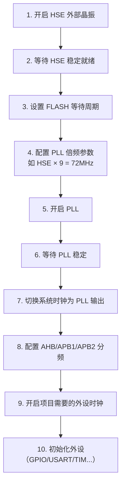

---
tags:
  - 嵌入式
  - STM32
  - RCC
  - 时钟
  - 知识库
created: 2026-07-16
---

# RCC（复位与时钟控制）

> [!info] 这篇笔记解决什么问题
> RCC 是 STM32 里你碰到的第一个"必须先配置才能用"的模块。这篇笔记把 RCC 的两大核心功能——时钟管理和复位控制——讲清楚，帮你理解"为什么用外设之前必须先开时钟"。

相关笔记：[[寄存器]] [[GPIO和AFIO]] [[32DAY1]]

---

## RCC 是什么

**RCC = Reset and Clock Control**，复位与时钟控制模块。

一句话理解：RCC 是整个芯片的**电源开关 + 调速器 + 复位按钮**。

```
                    ┌─────────────────────────────┐
                    │           RCC                │
                    │                             │
  时钟管理 ──────────┤  · 开/关每个外设的时钟        │
  (最常用)           │  · 选择系统主时钟源          │
                    │  · PLL 倍频给 CPU 提速       │
                    │  · 给不同总线分配不同速度     │
                    │                             │
  复位控制 ──────────┤  · 上电复位、按键复位        │
                    │  · 看门狗复位                │
                    │  · 单独复位某个外设           │
                    └─────────────────────────────┘
```

> [!tip] 为什么需要 RCC
> STM32 有几十个外设，如果全部同时开着，功耗很大、发热严重。所以设计成：**上电后所有外设时钟默认关闭，你用到哪个就开哪个**。RCC 就是那个"开关面板"。

---

## 一、时钟管理（最常用）

### 1. 开启外设时钟

这是你写代码时**每时每刻都在做**的事。

> [!danger] 新手第一大坑
> 外设配置全对，接线没问题，但就是没反应 —— 99% 是忘了开时钟。

```c
// STM32F1 系列（你用的 STM32F103C8T6）
RCC_APB2PeriphClockCmd(RCC_APB2Periph_GPIOA, ENABLE);   // 开 GPIOA
RCC_APB2PeriphClockCmd(RCC_APB2Periph_USART1, ENABLE);  // 开 USART1
RCC_APB1PeriphClockCmd(RCC_APB1Periph_TIM2, ENABLE);    // 开 TIM2
RCC_APB1PeriphClockCmd(RCC_APB1Periph_I2C1, ENABLE);    // 开 I2C1
```

> [!warning] 注意区分 F1 和 F4
> 原文中出现了 `RCC_AHB1PeriphClockCmd`，那是 STM32F4 系列的写法。你用的是 F1 系列（STM32F103C8T6），GPIO 挂在 APB2 上，要用 `RCC_APB2PeriphClockCmd`。

### 2. 四种时钟源

STM32 有 4 种基础时钟源，先理解它们各自干什么：

```
   ┌──────────────────────────────────────────────────────┐
   │                  STM32 时钟源                         │
   │                                                      │
   │   HSI ──┐                                            │
   │  (内部   │  ┌──────┐                                  │
   │   8MHz  ├──┤      │     ┌─────────┐                   │
   │   RC)   │  │ MUX  │────→│   PLL   │──→ 倍频后高频率   │
   │        │  │ 选择  │     │  倍频器  │    (如 72MHz)     │
   │   HSE ──┤  │      │     └─────────┘                   │
   │  (外部   │  └──────┘                                   │
   │   晶振   │       │                                     │
   │   8MHz)  │       └──────────────→ SYSCLK (系统主时钟)   │
   │        │                                             │
   │   LSI ──┼──────→ 独立看门狗 (IWDG)                     │
   │  (内部   │                                             │
   │   40kHz)│                                             │
   │        │                                             │
   │   LSE ──┼──────→ RTC 实时时钟                          │
   │  (外部   │                                             │
   │  32.768 │                                             │
   │   kHz)  │                                             │
   └────────┘                                             │
```

| 时钟源 | 全称 | 频率 | 用途 | 特点 |
|:-------|:-----|:-----|:-----|:-----|
| **HSI** | 内部高速 RC | ~8MHz | 上电默认时钟，PLL 备用输入 | 芯片自带，不用外接晶振。精度差，温漂大 |
| **HSE** | 外部高速晶振 | 通常 8MHz | **主时钟源**，PLL 输入 | 外接晶振，频率稳定精准。做项目首选 |
| **LSI** | 内部低速 RC | ~40kHz | 独立看门狗 (IWDG) | 低频省电，专门给看门狗用 |
| **LSE** | 外部低速晶振 | 32.768kHz | RTC 实时时钟 | 板子上的小晶振，走时分秒用 |

> [!tip] 简单记
> - H 开头的 = 高速（给 CPU 和外设用）
> - L 开头的 = 低速（给看门狗和 RTC 用）
> - I 结尾的 = 内部（芯片自带，不用接线）
> - E 结尾的 = 外部（要接晶振）

### 3. PLL 倍频（给 CPU 提速）

HSE 只有 8MHz，CPU 跑不快。PLL 是一个倍频器，把 8MHz 放大：

```
  HSE 8MHz ──→  PLL 倍频 ×9  ──→  72MHz (STM32F103 最高主频)

  过程：8 × 9 = 72MHz
```

> [!note] F1 和 F4 的区别
> - STM32F103（F1系列）：PLL 倍频后最高 72MHz
> - STM32F407（F4系列）：PLL 倍频后最高 168MHz
> 原文中提到的 168MHz 是 F4 的参数，你的 F1 最高是 72MHz。

### 4. 总线时钟分配

SYSCLK（系统主时钟）出来后，分给三条总线，每条总线可以独立分频：

```
                    SYSCLK (最高 72MHz)
                       │
          ┌────────────┼────────────┐
          │            │            │
     ┌────┴────┐  ┌───┴────┐  ┌───┴────┐
     │  AHB    │  │  APB2  │  │  APB1  │
     │  不分频  │  │ 不分频  │  │  /2    │
     │ 72MHz   │  │ 72MHz  │  │ 36MHz  │
     └────┬────┘  └───┬────┘  └───┬────┘
          │           │            │
     ┌────┴────┐ ┌────┴────┐ ┌────┴────┐
     │ CPU     │ │ GPIO    │ │ TIM2~4  │
     │ DMA     │ │ USART1  │ │ I2C1/2  │
     │ GPIO    │ │ ADC1/2  │ │ USART2~5│
     │ Flash   │ │ TIM1    │ │ SPI2/3  │
     └─────────┘ └─────────┘ └─────────┘
```

| 总线 | 最大频率 | 挂了什么外设 | 为什么要分 |
|:-----|:---------|:------------|:-----------|
| **AHB** | 72MHz | CPU 内核、DMA、Flash、GPIO | 高速，直连内核 |
| **APB2** | 72MHz | GPIO、USART1、ADC、TIM1、SPI1 | 高速外设 |
| **APB1** | 36MHz | TIM2~4、I2C、USART2~5、SPI2~3 | 低速外设，省电 |

> [!tip] 怎么知道某个外设挂在哪条总线上
> 翻参考手册的"时钟树"章节，或者直接看库函数名：
> - `RCC_APB2PeriphClockCmd()` → APB2 上的外设
> - `RCC_APB1PeriphClockCmd()` → APB1 上的外设

> [!abstract] 核心结论
> ==靠 HSE 提供稳定基础频率，PLL 拉高 CPU 速度，再分给 AHB/APB1/APB2 三条总线==

---

## 二、复位控制

RCC 还管理芯片的各种复位信号：

| 复位类型 | 触发条件 | 影响范围 |
|:---------|:---------|:---------|
| 上电复位 | 芯片刚通电 | 整个芯片 |
| 手动复位 | 按下板子上的 RESET 键 | 整个芯片 |
| 看门狗复位 | 程序卡死后看门狗超时 | 整个芯片 |
| 外设单独复位 | 软件写 RCC 寄存器 | 只复位指定外设 |
| 备份域复位 | 软件触发 | 只重置 RTC 和备份寄存器 |

> [!tip] 实用场景
> 程序跑飞后重启，可以通过读 RCC 的复位标志寄存器（CSR）来判断是哪种原因导致的复位，方便排查 bug。比如是看门狗复位说明程序卡死了，是上电复位说明是正常开机。

---

## 三、标准开发流程

在实际项目中，系统时钟配置的完整流程：



> [!note] 标准库已经帮你做好了
> 使用标准库时，上面的 1~8 步已经在 `SystemInit()` 函数里自动完成了（启动文件里调用的）。你只需要关心第 9 步：**开启你用到的外设时钟**。

### 你实际只需要写的代码

```c
// 你的 main 函数里，外设初始化之前：
// 只需要这一步——开时钟

// 用 GPIO 就开 GPIO 时钟
RCC_APB2PeriphClockCmd(RCC_APB2Periph_GPIOA, ENABLE);
RCC_APB2PeriphClockCmd(RCC_APB2Periph_GPIOC, ENABLE);

// 用 USART1 就开 USART1 时钟
RCC_APB2PeriphClockCmd(RCC_APB2Periph_USART1, ENABLE);

// 用 I2C1 就开 I2C1 时钟
RCC_APB1PeriphClockCmd(RCC_APB1Periph_I2C1, ENABLE);

// 用 TIM2 就开 TIM2 时钟
RCC_APB1PeriphClockCmd(RCC_APB1Periph_TIM2, ENABLE);

// 用 ADC1 就开 ADC1 时钟
RCC_APB2PeriphClockCmd(RCC_APB2Periph_ADC1, ENABLE);

// 然后再配外设的寄存器/调用外设初始化函数
```

---

## 四、外设时钟速查表

| 外设 | 挂在哪条总线 | 库函数 | 时钟宏定义 |
|:-----|:-----------|:------|:-----------|
| GPIOA | APB2 | `RCC_APB2PeriphClockCmd` | `RCC_APB2Periph_GPIOA` |
| GPIOB | APB2 | `RCC_APB2PeriphClockCmd` | `RCC_APB2Periph_GPIOB` |
| GPIOC | APB2 | `RCC_APB2PeriphClockCmd` | `RCC_APB2Periph_GPIOC` |
| AFIO | APB2 | `RCC_APB2PeriphClockCmd` | `RCC_APB2Periph_AFIO` |
| USART1 | APB2 | `RCC_APB2PeriphClockCmd` | `RCC_APB2Periph_USART1` |
| ADC1 | APB2 | `RCC_APB2PeriphClockCmd` | `RCC_APB2Periph_ADC1` |
| TIM1 | APB2 | `RCC_APB2PeriphClockCmd` | `RCC_APB2Periph_TIM1` |
| SPI1 | APB2 | `RCC_APB2PeriphClockCmd` | `RCC_APB2Periph_SPI1` |
| USART2 | APB1 | `RCC_APB1PeriphClockCmd` | `RCC_APB1Periph_USART2` |
| I2C1 | APB1 | `RCC_APB1PeriphClockCmd` | `RCC_APB1Periph_I2C1` |
| TIM2 | APB1 | `RCC_APB1PeriphClockCmd` | `RCC_APB1Periph_TIM2` |
| TIM3 | APB1 | `RCC_APB1PeriphClockCmd` | `RCC_APB1Periph_TIM3` |
| TIM4 | APB1 | `RCC_APB1PeriphClockCmd` | `RCC_APB1Periph_TIM4` |
| SPI2 | APB1 | `RCC_APB1PeriphClockCmd` | `RCC_APB1Periph_SPI2` |

---

## 五、踩坑记录

| 现象 | 原因 | 解决 |
|:-----|:-----|:-----|
| 外设配完没反应 | 忘了开时钟 | 用任何外设前先开对应 RCC 时钟 |
| 开了时钟还是不行 | 开错了总线 | GPIO 在 APB2 不是 APB1，查速查表 |
| 用了 F4 的代码 | 库函数名不一样 | F1 用 `RCC_APB2`，F4 用 `RCC_AHB1` |
| I2C 读写不到数据 | 只开了 I2C 没开 GPIO | I2C 和 GPIO 时钟都要开 |
| 重映射不生效 | 忘了开 AFIO 时钟 | `RCC_APB2PeriphClockCmd(RCC_APB2Periph_AFIO, ENABLE)` |

---

## 参考链接

- [[寄存器]] — RCC 寄存器的位域定义
- [[GPIO和AFIO]] — GPIO/AFIO 时钟开启
- [[传感器]] — 各传感器需要开哪些时钟
- [[STM32F10xxx参考手册（中文）]] — 第 6 章 RCC
- [[32DAY1]] — 学习记录
