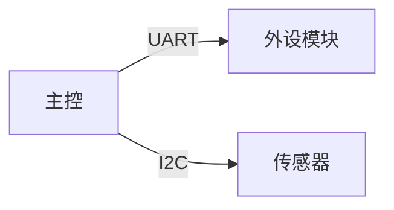
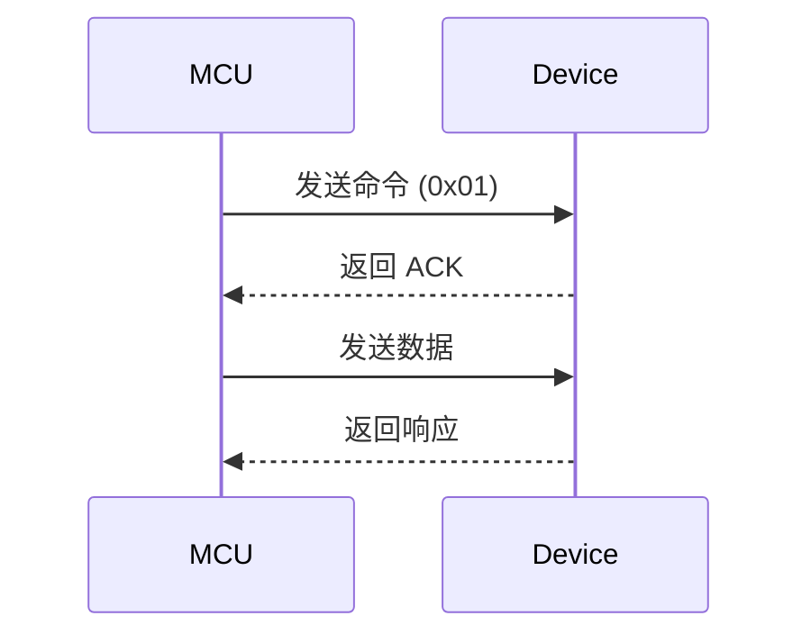

# {{标题}}

## 📌 概述

> [!abstract] 一句话总结
> 用一句话描述本文要讲什么。

---

## 🧱 基础知识 / 前置概念

- 概念 A：
- 概念 B：
- 相关笔记：[[xxx]]

---

## 🔧 硬件相关

### 芯片 / 模块信息

| 项目 | 内容 |
|------|------|
| 芯片型号 | |
| 内核 | Cortex-M0 / M3 / M4 / ... |
| 主频 | |
| Flash / SRAM | |
| 封装 | |
| 供电电压 | |
| 数据手册 | [链接]() |

### 引脚 / 接口

| 引脚 | 功能 | 连接目标 | 备注 |
|------|------|----------|------|
| PA0  | UART_TX | | |
| PA1  | UART_RX | | |

### 原理图 / 接线图

> [!note] 接线说明
> （此处可插入图片：``![[接线图.png]]``）



---

## 💻 软件相关

### 寄存器 / 配置

| 寄存器 | 地址 | 位 | 说明 |
|--------|------|----|------|
| | | | |

### 关键代码

> [!tip] 思路说明
> 这段代码做了什么，为什么这样写。

```c
/**
 * @brief  函数功能简述
 * @param  param1  参数1说明
 * @param  param2  参数2说明
 * @return 返回值说明
 * @note   注意事项
 */
void function_name(uint8_t param1, uint16_t param2)
{
    // 步骤1：xxx
    // 步骤2：xxx

    // TODO: 待优化点
}
```

#### 代码逐段解析

1. **初始化阶段**：
   ```c
   // 配置时钟
   RCC_APB2PeriphClockCmd(RCC_APB2Periph_GPIOA, ENABLE);
   ```
   解析：使能 GPIOA 时钟，因为该外设挂在 APB2 总线上。

2. **核心逻辑**：
   ```c
   // ...
   ```
   解析：...

### 时序图 / 流程图



### 通信协议笔记

| 协议 | 线数 | 速率 | 拓扑 | 适用场景 |
|------|------|------|------|----------|
| UART | 2 (TX/RX) | 低 | 点对点 | 调试、简单通信 |
| I2C  | 2 (SCL/SDA) | 中 | 多设备总线 | 传感器 |
| SPI  | 4 (MOSI/MISO/SCK/CS) | 高 | 点对点 | 显示屏、Flash |
| CAN  | 2 (CANH/CANL) | 中 | 总线 | 汽车、工业 |

---

## 🧪 实验 / 验证

### 实验目的

### 实验环境

| 项目 | 内容 |
|------|------|
| 开发板 | |
| IDE / 编译器 | Keil / IAR / GCC / ... |
| 调试器 | ST-Link / J-Link / DAP-Link |
| 库版本 | HAL v1.x / Standard Peripheral / ... |
| 其他工具 | 逻辑分析仪 / 示波器 / ... |

### 实验步骤

1. 
2. 
3. 

### 实验结果

> [!success] 预期结果
> 

> [!failure] 实际遇到的问题
> 

### 串口 / 日志输出

```
[INFO]  System Init OK
[DEBUG] Sensor value: 0x3F
[ERROR] Timeout waiting for ACK
```

---

## 🐛 调试与排错

### 遇到的问题

> [!bug] 问题描述
> **现象**：
> **原因**：
> **解决方法**：
> **启示 / 教训**：

| # | 现象 | 原因 | 解决方案 | 日期 |
|---|------|------|----------|------|
| 1 | | | | |
| 2 | | | | |

### 调试技巧

- 
- 

### 常用调试命令 / 脚本

```bash
# 通过 OpenOCD 连接调试
openocd -f interface/stlink.cfg -f target/stm32f1x.cfg

# 查看串口输出
minicom -D /dev/ttyUSB0 -b 115200
```

---

## 📊 性能 / 数据记录

| 测试项 | 数值 | 单位 | 备注 |
|--------|------|------|------|
| 功耗   | | mA | |
| 响应时间 | | ms | |
| 内存占用 | | Bytes | |

---

## 🔗 相关资源

### 官方文档
- [参考手册]()
- [数据手册]()
- [应用笔记 ANxxxx]()

### 参考博客 / 文章
- [标题](链接) —— 要点：

### 相关笔记 (MOC 或关联)
- [[xxx]]
- [[yyy]]

---

## 📝 总结

### 关键要点
- 
- 
- 

### 下一步学习
- [ ] 
- [ ] 

---

> [!quote] 
> 好的代码自己就是文档，但好的文档让代码走得更远。

---

<!--
============================================================
使用说明：
1. 按需删除不相关的章节，不要为了填满模板而硬写。
2. 图片用 Obsidian 格式：![[图片名.png]] 或 
3. Mermaid 图表在 Obsidian 中直接渲染，代码块用 ```c / ```python 等
4. 多用 [[双向链接]] 连接其他笔记，构建知识网络。
5. Callout 类型：note, abstract, info, tip, success, question, warning, failure, danger, bug, example, quote
6. YAML 的 tags 和 aliases 用于 Obsidian 搜索和图谱。
============================================================
-->
